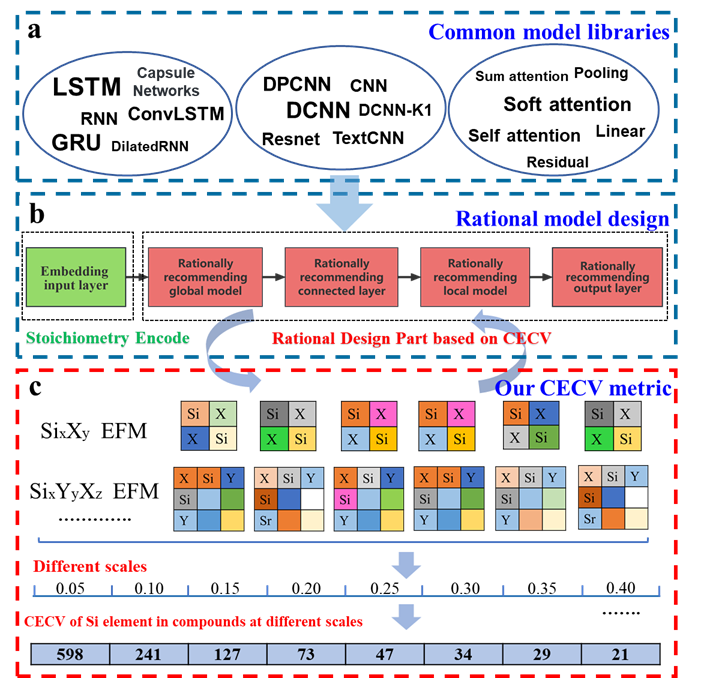

# LGDCNN

<strong>**Rational Design of Deep Learning Networks Based on Fusion Strategy for Improved Materials Property Predictions**</strong> </br>
<em>JCTC (XXX)</em>  </br>
[Hongwei Du, Hong Wang] </br>
Shanghai Jiao Tong University </br>



The success of machine learning in predicting material properties depends largely on the design of the model. However, the current designs of Deep learning (DL) models in materials science have the following prominent problems. Firstly, the model design lacks a rational guidance strategy and heavily relies on a large amount of trial and error. Secondly, numerous DL models are utilized across various fields, each with its own advantages and disadvantages. Therefore, it is important to incorporate a fusion strategy to fully leverage them and further expand the design strategies of the models. To address these problems, we analyze that the main reason is the lack of new feedback method rich in physical insights. In this study, we developed a feedback method called Chemical Environment Classification Vector (CECV) of elements in compounds at different scales, which is rich in physical insights. Based on CECV, we rationally designed the Long Short-Term Memory1 and Gated Recurrent Unit2 fusion with Deep Convolutional Neural Network (L-G-DCNN) to explore the field of structure-agnostic materials property predictions. L-G-DCNN accurately captures the interactions between elements in compounds, resulting in more accurate and efficient predictions of material properties compared to the Crabnet3. Our results demonstrate that the performance of the L-G-DCNN surpasses the current state-of-the-art models across 28 benchmark datasets, exhibiting superior sample efficiency and faster convergence speed. By employing different visualization methods, we demonstrate that the fusion strategy based on CECV significantly enhances the comprehension of the L-G-DCNN model design and provides a fresh perspective for researchers in the field of materials informatics.

If you find our work useful in your research, please cite:

```

{
Have been accepeted by JCTC,Accepted on 08 July 2024. Hongwei Du, Hong Wang*
1 School of Materials Science and Engineering, Shanghai Jiao Tong University, Shanghai 200240, China.
2 Zhangjiang Institute for Advanced Study, Shanghai Jiao Tong University, Shanghai 201203, China.
3 Materials Genome Initiative Center, Shanghai Jiao Tong University, Shanghai 200240, China.

}
```


## Getting Started

### Installation

Set up conda environment and clone the github repo

```
# create a new environment
$ conda create -n pytorch python=3.9
$ conda activate pytorch
$ conda install pytorch==1.10.1 cudatoolkit=11.3 -c pytorch -c conda-forge
$ conda install --channel conda-forge pymatgen
$ pip install transformers
$ conda install -c conda-forge tensorboard
$ conda install matminer

# clone the source code of LGDCNN
$ git clone https://github.com/dhw059/DeepModelFusion
$ cd lgdcnn
```

### Dataset

All the data used in this work can be found in `data/benchmark_data` folder. 

Chemical Environment Classification Vector for all discrete and fusion models in the data/README file.

### Checkpoints

Pre-trained model can be found in the train_models/README file.

## Run the Model

### Pre-training

Train all  models in the   `paper/application.ipynb` .

### Fine-tuning

To fine-tune the pre-trained LGDCNN or learn about the architectures, inputs, outputs, and some visualizations of all discrete and fusion models, please refer to the code in the   `lgdcnn`  folder.
## Acknowledgement
- Crabnet: https://github.com/anthony-wang/CrabNet

  
